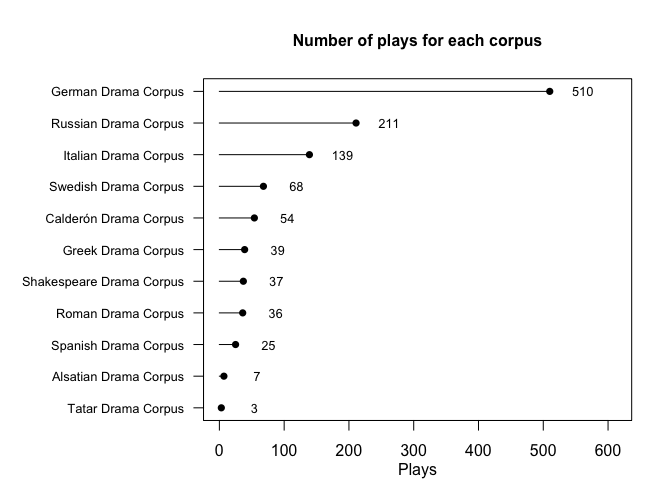

<!-- README.md is generated from README.Rmd. Please edit that file -->
rdracor 
====================================================================

<!-- badges: start -->
[](https://travis-ci.org/Pozdniakov/rdracor) [](https://codecov.io/gh/Pozdniakov/rdracor?branch=master) <!-- badges: end -->

The goal of rdracor is to provide an R interface for the [Drama Corpora Project (Dracor) API](https://dracor.org/documentation/api). More on Dracor project [here](https://dracor.org).

Installation
------------

``` r
#install.packages("devtools") #if you don't have devtools installed
devtools::install_github("dracor-org/rdracor")
```

General info on corpora
-----------------------

We can extract general information about available corpora:

``` r
library(rdracor)
```

``` r
corpora <- get_dracor()
summary(corpora)
#> There are 953 plays in 10 corpora    
#> 
#> The last update was 2020-01-08 17:13:51 for German Drama Corpus
plot(corpora)
```



Plays in the corpus
-------------------

``` r
ru <- get_corpus(corpus = "rus")
summary(ru)
#> Written years (range): 1747 - 1940   
#> Premiere years (range): 1750 - 1992  
#> Years of the first printing (range): 1747 - 1986 
#> 210 plays in Russian Drama Corpus    
#> Corpus id: rus, repository: https://github.com/dracor-org/rusdracor
ru_au <- authors(ru)
summary(ru_au)
#> There are 57 authors in Russian Drama Corpus 
#> 
#> Top authors of the Corpus:   
#>  - Островский, Александр Николаевич  
#>  - Сумароков, Александр Петрович 
#>  - Чехов, Антон Павлович 
#>  - Булгаков, Михаил Афанасьевич  
#>  - Тургенев, Иван Сергеевич
plot(ru_au, top_minplays = 4)
```


Play network
------------

You can extract network for a specific play:

``` r
godunov <- play_igraph(corpus = "rus",
                       play = "pushkin-boris-godunov")
```

This will create an object of S3 class `"play_igraph"` that inherits from `"igraph"`. It means that you can work with it as an `"igraph"` object:

``` r
library(igraph)
#> 
#> Attaching package: 'igraph'
#> The following objects are masked from 'package:stats':
#> 
#>     decompose, spectrum
#> The following object is masked from 'package:base':
#> 
#>     union
edge_density(godunov)
#> [1] 0.1061344
diameter(godunov)
#> [1] 7
graph.cohesion(godunov)
#> [1] 1
```

You can plot it: it will use plot method for `igraph` objects with some adjusted parameters. For example, vertices are coloured based on the gender and shape is based on whether a character is a group:

``` r
plot(godunov)
```


