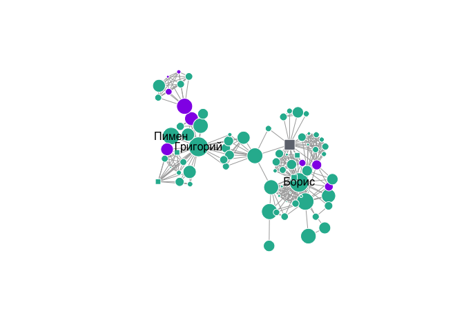

<!-- README.md is generated from README.Rmd. Please edit that file -->

# rdracor 

<!-- badges: start -->

[](https://travis-ci.org/dracor-org/rdracor)
[](https://codecov.io/gh/dracor-org/rdracor?branch=master)
<!-- badges: end -->

**Authors:** Ivan Pozdniakov, Frank Fischer<br /> **Licence:**
[GPL-3](https://opensource.org/licenses/GPL-3.0)

The goal of **rdracor** is to provide an R interface for the [DraCor
API](https://dracor.org/documentation/api) (DraCor: Drama Corpora
Project). Website of the project: [dracor.org](https://dracor.org).

## Installation

``` r
#install.packages("remotes") #if you don't have remotes installed
remotes::install_github("dracor-org/rdracor")
```

## General info on corpora

Retrieving general information about available corpora:

``` r
library(rdracor)
```

``` r
corpora <- get_dracor_meta()
summary(corpora)
#> DraCor hosts 15 corpora comprising 3034 plays.
#> 
#> The last updated corpus was German Drama Corpus (2022-12-22 21:23:40).
plot(corpora)
```


## Plays in the corpus

``` r
ru <- get_dracor(corpus = "rus")
summary(ru)
#> 212 plays in Russian Drama Corpus    
#> Corpus id: rus, repository: https://github.com/dracor-org/rusdracor  
#> Description: Edited by Frank Fischer and Daniil Skorinkin. Features more than 200 Russian plays from the 1740s to the 1940s. For a corpus description and full credits please see the [README on GitHub](https://github.com/dracor-org/rusdracor).
#> Written years (range): 1747 - 1940   
#> Premiere years (range): 1750 - 1992  
#> Years of the first printing (range): 1747 - 1986
```

You can get all corpora at once:

``` r
all <- get_dracor()
summary(all)
#> 3034 plays in 15 corpora:    
#> Corpora id:  
#> fre (1560 plays), ger (597 plays), rus (212 plays), cal (205 plays), ita (139 plays), swe (68 plays), hun (41 plays), greek (40 plays), gersh (38 plays), shake (37 plays), rom (36 plays), als (30 plays), span (25 plays), bash (3 plays), tat (3 plays)
#> Written years (range): 43 - 1970 
#> Premiere years (range): -472 - 1992  
#> Years of the first printing (range): 1170 - 2017
```

## Play network

You can extract a network (undirected weighted graph) for a specific
play:

``` r
godunov <- play_igraph(corpus = "rus",
                       play = "pushkin-boris-godunov")
```

This will create an object of S3 class `"play_igraph"` that inherits
from `"igraph"`. It means that you can work with it as an `"igraph"`
object:

``` r
library(igraph)
edge_density(godunov)
#> [1] 0.1061344
diameter(godunov, weights = NA)
#> [1] 6
graph.cohesion(godunov)
#> [1] 1
```

You can plot the graph: `plot()` will use plot method for `igraph`
objects with some adjusted parameters. For example, vertices are
coloured based on the gender and shape is based on whether a character
is a group:

``` r
plot(godunov)
```



In addition, you can get a summary with network properties and gender
distribution:

``` r
summary(godunov)
#> rus: pushkin-boris-godunov - network summary 
#>  
#>          Size: 79 (9 FEMALES, 69 MALES, 1 UNKNOWN)   
#>       Density: 0.11  
#>        Degree:   
#>          - Maximum: 29 (Борис)   
#>      Distance:   
#>          - Maximum (Diameter): 7 
#>          - Average: 3.45 
#>    Clustering:   
#>          - Global: 0.65  
#>          - Average local: 0.92   
#>      Cohesion: 1 
#> Assortativity: -0.06
```

## Text of the play

You can get text of a play in different forms:

- as a raw TEI (optionally parsed with {xml2})

``` r
get_play_tei(corpus = "rus", play = "pushkin-boris-godunov")
#> {xml_document}
#> <TEI id="rus000042" lang="rus" xmlns="http://www.tei-c.org/ns/1.0">
#> [1] <teiHeader>\n  <fileDesc>\n    <titleStmt>\n      <title type="main">Бори ...
#> [2] <standOff>\n  <listEvent>\n    <event type="print" when="1831">\n      <l ...
#> [3] <text>\n  <front>\n    <docTitle>\n      <titlePart type="main">Борис Год ...
```

- as a character vector:

``` r
text_godunov <- get_play_spoken_text(corpus = "rus", play = "pushkin-boris-godunov")
head(text_godunov)
#> [1] "Наряжены мы вместе город ведать,"    
#> [2] "Но, кажется, нам не за кем смотреть:"
#> [3] "Москва пуста; вослед за патриархом"  
#> [4] "К монастырю пошел и весь народ."     
#> [5] "Как думаешь, чем кончится тревога?"  
#> [6] "Чем кончится? Узнать немудрено:"
```

- as a data frame:

``` r
get_play_text_df(corpus = "rus", play = "pushkin-boris-godunov")
#> # A tibble: 1,993 × 10
#>    text        type  type_…¹ who   scene scene…² subdi…³ line_id subdi…⁴ scene…⁵
#>    <chr>       <chr> <chr>   <chr> <chr> <chr>   <chr>     <int>   <int>   <int>
#>  1 (1598 года… stage ""      <NA>  КРЕМ… scene 1 stage 1       1       1       1
#>  2 Князья Шуй… stage ""      <NA>  КРЕМ… scene 1 stage 2       2       2       1
#>  3 Наряжены м… l     ""      voro… КРЕМ… scene 1 sp 1 |…       3       3       1
#>  4 Но, кажетс… l     ""      voro… КРЕМ… scene 1 sp 1 |…       4       4       1
#>  5 Москва пус… l     ""      voro… КРЕМ… scene 1 sp 1 |…       5       5       1
#>  6 К монастыр… l     ""      voro… КРЕМ… scene 1 sp 1 |…       6       6       1
#>  7 Как думаеш… l     ""      voro… КРЕМ… scene 1 sp 1 |…       7       7       1
#>  8 Чем кончит… l     ""      shuj… КРЕМ… scene 1 sp 2 |…       8       8       1
#>  9 Народ еще … l     ""      shuj… КРЕМ… scene 1 sp 2 |…       9       9       1
#> 10 Борис еще … l     ""      shuj… КРЕМ… scene 1 sp 2 |…      10      10       1
#> # … with 1,983 more rows, and abbreviated variable names ¹​type_attributes,
#> #   ²​scene_path, ³​subdiv_path, ⁴​subdiv_id, ⁵​scene_id
```
