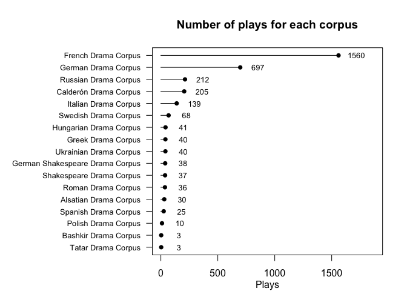
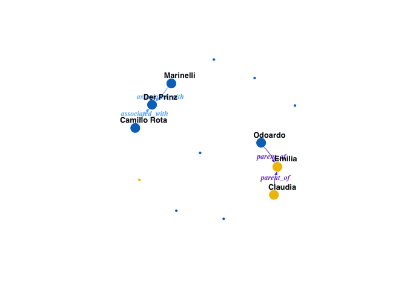

<!-- README.md is generated from README.Rmd. Please edit that file -->

# rdracor 

<!-- badges: start -->
<!-- badges: end -->

**Authors:** Ivan Pozdniakov, Frank Fischer<br /> **License:**
[GPL-3](https://opensource.org/license/gpl-3-0/)

The goal of **rdracor** is to provide an R interface for the [DraCor
API](https://dracor.org/documentation/api) (DraCor: Drama Corpora
Project). Website of the project: [dracor.org](https://dracor.org).

## Installation

Installation from CRAN:

``` r
install.packages("rdracor")
```

If you wish to install the current build of the next release you can do
so using the following:

    # install.packages("remotes")
    remotes::install_github("dracor-org/rdracor")

``` r
library(rdracor)
```

## Select DraCor API

DraCor API has several versions. By default, it utilizes the main
branch:

``` r
get_dracor_api_url()
#> [1] "https://dracor.org/api"
```

You can set DraCor URL API of your choice:

``` r
set_dracor_api_url("https://staging.dracor.org/api/v1")
```

## General info on corpora

Retrieving general information about available corpora:

``` r
corpora <- get_dracor_meta()
summary(corpora)
#> DraCor hosts 16 corpora comprising 3131 plays.
#> 
#> The last updated corpus was German Drama Corpus (2023-11-10 19:21:44).
plot(corpora)
```



## Plays in the corpus

``` r
ger <- get_dracor(corpus = "ger")
summary(ger)
#> 654 plays in German Drama Corpus 
#> Corpus id: ger, repository: https://github.com/dracor-org/gerdracor  
#> Description: Edited by Frank Fischer and Peer Trilcke. Features more than 600 German-language plays from the 1540s to the 1940s. For a corpus description and full credits please see the [README on GitHub](https://github.com/dracor-org/gerdracor).
#> Written years (range): 1549–1947 
#> Premiere years (range): 1539–1981    
#> Years of the first printing (range): 1540–1962
```

You can get all corpora at once:

``` r
all <- get_dracor()
summary(all)
#> 3131 plays in 16 corpora:    
#> Corpora id:  
#> fre (1560 plays), ger (654 plays), rus (212 plays), cal (205 plays), ita (139 plays), swe (68 plays), hun (41 plays), greek (40 plays), u (40 plays), gersh (38 plays), shake (37 plays), rom (36 plays), als (30 plays), span (25 plays), bash (3 plays), tat (3 plays)
#> Written years (range): 43–1970   
#> Premiere years (range): -472–1999    
#> Years of the first printing (range): 1170–2017
```

## Play metadata

With `get_play_metadata()` you can get miscellaneous data for a play:

``` r
get_play_metadata(play = "lessing-emilia-galotti", 
                  corpus = "ger",
                  full_metadata = FALSE) #use full_metadata = FALSE for faster download 
#> $id
#> [1] "ger000088"
#> 
#> $name
#> [1] "lessing-emilia-galotti"
#> 
#> $corpus
#> [1] "ger"
#> 
#> $title
#> [1] "Emilia Galotti"
#> 
#> $author
#> $author$name
#> [1] "Lessing, Gotthold Ephraim"
#> 
#> $author$warning
#> [1] "The single author property is deprecated. Use the array of 'authors' instead!"
#> 
#> 
#> $authors
#> # A tibble: 1 × 4
#>   name                      fullname                 shortname refs        
#>   <chr>                     <chr>                    <chr>     <list>      
#> 1 Lessing, Gotthold Ephraim Gotthold Ephraim Lessing Lessing   <df [2 × 2]>
#> 
#> $genre
#> [1] "Tragedy"
#> 
#> $libretto
#> [1] FALSE
#> 
#> $allInSegment
#> [1] 30
#> 
#> $allInIndex
#> [1] 0.6976744
#>
#> $characters
#> # A tibble: 13 × 12
#>    id         name  isGroup gender numOfScenes numOfSpeechActs numOfWords degree
#>    <chr>      <chr> <lgl>   <chr>        <int>           <int>      <int>  <int>
#>  1 der_prinz  Der … FALSE   MALE            17             157       4002      8
#>  2 der_kamme… Der … FALSE   MALE             2               6         33      1
#>  3 conti      Conti FALSE   MALE             2              24        604      1
#>  4 marinelli  Mari… FALSE   MALE            19             221       4343      9
#>  5 camillo_r… Cami… FALSE   MALE             1               6         78      1
#>  6 claudia    Clau… FALSE   FEMALE          13              73       1581      7
#>  7 pirro      Pirro FALSE   MALE             4              25        263      5
#>  8 odoardo    Odoa… FALSE   MALE            12             108       2441      6
#>  9 angelo     Ange… FALSE   MALE             2              28        487      2
#> 10 emilia     Emil… FALSE   FEMALE           7              64       1702      6
#> 11 appiani    Appi… FALSE   MALE             5              48        852      4
#> 12 battista   Batt… FALSE   MALE             4              11        152      4
#> 13 orsina     Orsi… FALSE   FEMALE           6              64       2111      4
#> # ℹ 4 more variables: weightedDegree <int>, closeness <dbl>, betweenness <dbl>,
#> #   eigenvector <dbl>
#> 
#> $segments
#> # A tibble: 43 × 4
#>    type  number title                              speakers 
#>    <chr>  <int> <chr>                              <list>   
#>  1 scene      1 Erster Aufzug | Erster Auftritt    <chr [2]>
#>  2 scene      2 Erster Aufzug | Zweiter Auftritt   <chr [2]>
#>  3 scene      3 Erster Aufzug | Dritter Auftritt   <chr [1]>
#>  4 scene      4 Erster Aufzug | Vierter Auftritt   <chr [2]>
#>  5 scene      5 Erster Aufzug | Fünfter Auftritt   <chr [1]>
#>  6 scene      6 Erster Aufzug | Sechster Auftritt  <chr [2]>
#>  7 scene      7 Erster Aufzug | Siebenter Auftritt <chr [2]>
#>  8 scene      8 Erster Aufzug | Achter Auftritt    <chr [2]>
#>  9 scene      9 Zweiter Aufzug | Erster Auftritt   <chr [2]>
#> 10 scene     10 Zweiter Aufzug | Zweiter Auftritt  <chr [2]>
#> # ℹ 33 more rows
#> 
#> $yearWritten
#> NULL
#> 
#> $yearPremiered
#> [1] "1772"
#> 
#> $yearPrinted
#> [1] "1772"
#> 
#> $yearNormalized
#> [1] 1772
#> 
#> $wikidataId
#> [1] "Q782653"
#> 
#> $subtitle
#> [1] "Ein Trauerspiel in fünf Aufzügen"
#> 
#> $relations
#> # A tibble: 4 × 4
#>   directed type            source       target   
#>   <lgl>    <chr>           <chr>        <chr>    
#> 1 TRUE     parent_of       odoardo      emilia   
#> 2 TRUE     parent_of       claudia      emilia   
#> 3 TRUE     associated_with marinelli    der_prinz
#> 4 TRUE     associated_with camillo_rota der_prinz
#> 
#> $source
#> $source$name
#> [1] "TextGrid Repository"
#> 
#> $source$url
#> [1] "http://www.textgridrep.org/textgrid:rksp.0"
#> 
#> 
#> $originalSource
#> [1] "Gotthold Ephraim Lessing: Werke. Herausgegeben von Herbert G. Göpfert in Zusammenarbeit mit Karl Eibl, Helmut Göbel, Karl S. Guthke, Gerd Hillen, Albert von Schirmding und Jörg Schönert, Band 1–8, München: Hanser, 1970 ff."
```

## Play network

You can extract a co-occurence network (undirected weighted graph) for a
specific play:

``` r
emilia <- get_net_cooccur_igraph(play = "lessing-emilia-galotti", corpus = "ger")
plot(emilia)
```


You can use the package `{igraph}` to work with this object as a graph:

``` r
library(igraph)
edge_density(emilia)
#> [1] 0.3717949
graph.cohesion(emilia)
#> [1] 1
```

In addition, you can get a summary with network properties and gender
distribution:

``` r
summary(emilia)
#> ger: lessing-emilia-galotti - co-ocurence network summary    
#> Lessing, Gotthold Ephraim: Emilia Galotti (1772) 
#>  
#>          Size: 13 (3 FEMALES, 10 MALES, 0 UNKNOWN)   
#>       Density: 0.37  
#>        Degree:   
#>          - Maximum: 9 (Marinelli)    
#>      Distance:   
#>          - Maximum (Diameter): 6 
#>          - Average: 3.03 
#>    Clustering:   
#>          - Global: 0.54  
#>          - Average local: 0.67   
#>      Cohesion: 1 
#> Assortativity: -0.45
```

Similarly, you can use function `get_net_relations_igraph()` to build a
network based on relationships data:

``` r
nedorosl_relations <- get_net_relations_igraph(play = "fonvizin-nedorosl",
                                               corpus = "rus")
plot(nedorosl_relations)
```



``` r
summary(nedorosl_relations)
#> rus: fonvizin-nedorosl - relations network summary   
#> Фонвизин, Денис Иванович: Недоросль (1782)   
#>  
#> Size: 15 (3 FEMALES, 12 MALES, 0 UNKNOWN)    
#> Relations: 8 
#> Простаков <--> Г-жа Простакова : spouses
#> Скотинин <--> Г-жа Простакова : siblings
#> Г-жа Простакова ---> Митрофан : parent_of
#> Простаков ---> Митрофан : parent_of
#> Еремеевна ---> Митрофан : associated_with
#> Софья ---> Стародум : related_with
#> ...and 2 more
```

## Text of a play

You can get text of a play in different forms:

- as a raw TEI (optionally parsed with `{xml2}`):

``` r
get_text_tei(play = "lessing-emilia-galotti", corpus = "ger")
#> {xml_document}
#> <TEI id="ger000088" lang="ger" xmlns="http://www.tei-c.org/ns/1.0">
#> [1] <teiHeader>\n  <fileDesc>\n    <titleStmt>\n      <title type="main">Emil ...
#> [2] <standOff>\n  <listEvent>\n    <event type="print" when="1772">\n      <d ...
#> [3] <text>\n  <front>\n    <titlePage>\n      <docAuthor>Gotthold Ephraim Les ...
```

- as a character vector:

``` r
text_godunov <- get_text_chr_spoken(play = "lessing-emilia-galotti",
                                     corpus = "ger")
head(text_godunov)
#> [1] "Klagen, nichts als Klagen! Bittschriften, nichts als Bittschriften! – Die traurigen Geschäfte; und man beneidet uns noch! – Das glaub' ich; wenn wir allen helfen könnten: dann wären wir zu beneiden. – Emilia? Eine Emilia? – Aber eine Emilia Bruneschi – nicht Galotti. Nicht Emilia Galotti! – Was will sie, diese Emilia Bruneschi? Viel gefodert; sehr viel. – Doch sie heißt Emilia. Gewährt! Es ist wohl noch keiner von den Räten in dem Vorzimmer?"
#> [2] "Nein."                                                                                                                                                                                                                                                                                                                                                                                                                                                        
#> [3] "Ich habe zu früh Tag gemacht. – Der Morgen ist so schön. Ich will ausfahren. Marchese Marinelli soll mich begleiten. Laßt ihn rufen. – Ich kann doch nicht mehr arbeiten. – Ich war so ruhig, bild' ich mir ein, so ruhig – Auf einmal muß eine arme Bruneschi, Emilia heißen; – weg ist meine Ruhe, und alles! –"                                                                                                                                            
#> [4] "Nach dem Marchese ist geschickt. Und hier, ein Brief von der Gräfin Orsina."                                                                                                                                                                                                                                                                                                                                                                                  
#> [5] "Der Orsina? Legt ihn hin."                                                                                                                                                                                                                                                                                                                                                                                                                                    
#> [6] "Ihr Läufer wartet."
```

- as a data frame:

``` r
get_text_df(play = "lessing-emilia-galotti", corpus = "ger")
#> # A tibble: 1,174 × 10
#>    text         type  type_attributes who   scene scene_path subdiv_path line_id
#>    <chr>        <chr> <chr>           <chr> <chr> <chr>      <chr>         <int>
#>  1 Die Szene, … stage ""              <NA>  Erst… act 1      stage 1           1
#>  2 an einem Ar… stage ""              der_… Erst… act 1 | s… sp 1 | sta…       2
#>  3 Klagen, nic… p     ""              der_… Erst… act 1 | s… sp 1 | p 1        3
#>  4 Indem er no… stage ""              der_… Erst… act 1 | s… sp 1 | p 1        4
#>  5 Eine Emilia… p     ""              der_… Erst… act 1 | s… sp 1 | p 1        5
#>  6 Er lieset.   stage ""              der_… Erst… act 1 | s… sp 1 | p 1        6
#>  7 Viel gefode… p     ""              der_… Erst… act 1 | s… sp 1 | p 1        7
#>  8 Er untersch… stage ""              der_… Erst… act 1 | s… sp 1 | p 1        8
#>  9 Es ist wohl… p     ""              der_… Erst… act 1 | s… sp 1 | p 1        9
#> 10 Nein.        p     ""              der_… Erst… act 1 | s… sp 2 | p 1       10
#> # ℹ 1,164 more rows
#> # ℹ 2 more variables: subdiv_id <int>, scene_id <int>
```

## Changing DraCor API

If you want to use another version of DraCor API (e.g. staging or
locally saved on your computer), you can use function
`set_dracor_api_url()`:

``` r
set_dracor_api_url("https://staging.dracor.org/api")
#> Working DraCor repository was changed from https://dracor.org/apiDraCor API URL:  https://staging.dracor.org/api 
#>  name: DraCor API v0
#> version: 0.91.2
#> status: beta
#> existdb: 6.2.0
#> base: https://staging.dracor.org/api/v0
get_dracor("u")
#> # A tibble: 40 × 55
#>    corpus id      playName yearNormalized title subtitle firstAuthorName authors
#>  * <chr>  <chr>   <chr>             <int> <chr> <chr>    <chr>           <list> 
#>  1 u      u000001 lesya-u…           1911 Адво… <NA>     Українка, Леся  <df>   
#>  2 u      u00000… lesya-u…           1905 Три … <NA>     Українка, Леся  <df>   
#>  3 u      u00000… lesya-u…           1901 Одер… Драмати… Українка, Леся  <df>   
#>  4 u      u00000… lesya-u…           1909 У пу… <NA>     Українка, Леся  <df>   
#>  5 u      u00000… lesya-u…           1896 Блак… <NA>     Українка, Леся  <df>   
#>  6 u      u00000… lesya-u…           1906 В до… <NA>     Українка, Леся  <df>   
#>  7 u      u00000… lesya-u…           1898 Іфіг… (драмат… Українка, Леся  <df>   
#>  8 u      u00000… kropivn…           1863 Дай … Драма в… Кропивницький,… <df>   
#>  9 u      u00000… lesya-u…           1896 Прощ… <NA>     Українка, Леся  <df>   
#> 10 u      u00000… lesya-u…           1903 У по… Драмати… Українка, Леся  <df>   
#> # ℹ 30 more rows
#> # ℹ 47 more variables: source <chr>, sourceUrl <chr>, writtenYearStart <lgl>,
#> #   writtenYearFinish <int>, printYearStart <lgl>, printYearFinish <lgl>,
#> #   premiereYearStart <lgl>, premiereYearFinish <lgl>, wikidataId <lgl>,
#> #   networkSize <int>, networkdataCsvUrl <chr>, normalizedGenre <lgl>,
#> #   size <int>, density <dbl>, diameter <int>, averageClustering <dbl>,
#> #   averagePathLength <dbl>, averageDegree <dbl>, maxDegree <int>, …
```

Information on the working API can be retrieved by `dracor_api_info()`:

``` r
dracor_api_info()
#> DraCor API URL:  https://staging.dracor.org/api 
#>  name: DraCor API v0
#> version: 0.91.2
#> status: beta
#> existdb: 6.2.0
#> base: https://staging.dracor.org/api/v0
```

## Acknowledgments

The development of this research software was supported by Computational
Literary Studies Infrastructure (CLS INFRA) through its Transnational
Access Fellowship programme. CLS INFRA has received funding from the
European Union’s Horizon 2020 research and innovation programme under
grant agreement №101004984.


